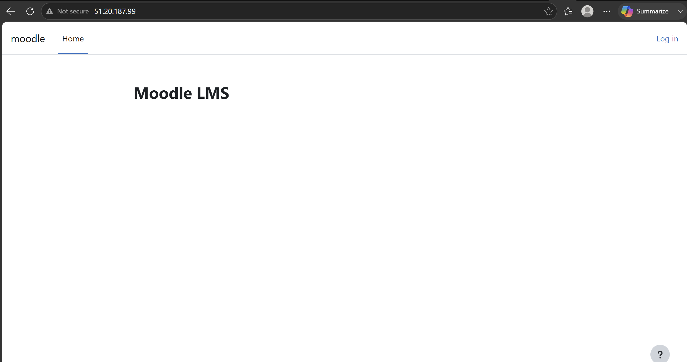
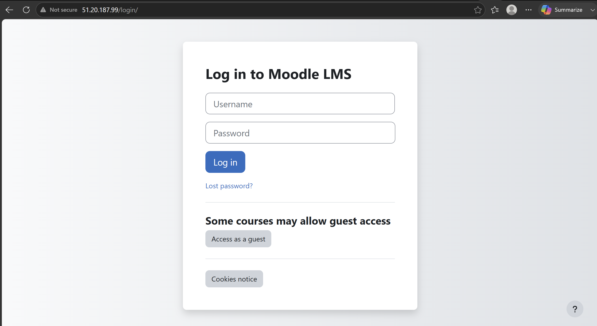
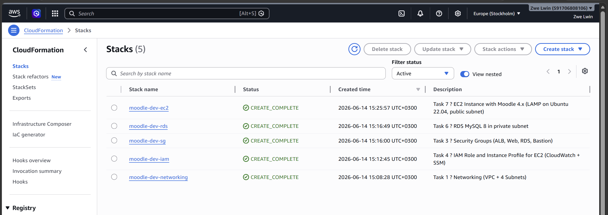

# Moodle LMS on AWS — Infrastructure as Code

**Author:** Zwe Khant Lwin  
**Course:** Practical IaC Deployment · Haaga-Helia University of Applied Sciences  
**Year:** 2025

A production-grade Moodle LMS deployment on AWS, built entirely with CloudFormation. 11 modular stacks cover every layer of the infrastructure — from VPC and networking through to monitoring and storage.

---

## Live Deployment

> Deployed and verified on AWS eu-north-1 (Stockholm) — June 2026

| Moodle Homepage | Moodle Login |
|---|---|
|  |  |

**CloudFormation — all 5 stacks CREATE_COMPLETE:**



---

## Architecture

```
Internet
    │
    ▼
┌─────────────────────────────────────────────────────────┐
│  VPC  10.25.92.0/22                                     │
│                                                         │
│  ┌──────────────────┐    ┌──────────────────┐           │
│  │  Public Subnet 1 │    │  Public Subnet 2 │           │
│  │  10.25.92.0/24   │    │  10.25.93.0/24   │           │
│  │                  │    │                  │           │
│  │  [ALB node]      │    │  [ALB node]      │           │
│  │  [Bastion Host]  │    │                  │           │
│  │  [NAT Gateway]   │    │                  │           │
│  └────────┬─────────┘    └────────┬─────────┘           │
│           │                       │                     │
│           ▼                       ▼                     │
│  ┌──────────────────┐    ┌──────────────────┐           │
│  │  Private Subnet 1│    │  Private Subnet 2│           │
│  │  10.25.94.0/24   │    │  10.25.95.0/24   │           │
│  │                  │    │                  │           │
│  │  [EC2 - Moodle]  │    │  [RDS - MySQL]   │           │
│  └──────────────────┘    └──────────────────┘           │
│                                                         │
└─────────────────────────────────────────────────────────┘
          |                          |
          v                          v
    [S3 - Files]           [CloudWatch - Monitoring]
```

---

## Stacks

| # | Stack | Description |
|---|-------|-------------|
| 01 | `task01-networking` | VPC, 4 subnets, Internet Gateway, route tables |
| 02 | `task02-nat-gateway` | Elastic IP + NAT Gateway for private subnet egress |
| 03 | `task03-security-groups` | SGs for ALB, web server, database, and bastion |
| 04 | `task04-iam` | EC2 IAM role and instance profile (CloudWatch + SSM) |
| 05 | `task05-bastion` | Bastion host in public subnet for SSH access |
| 06 | `task06-rds` | RDS MySQL 8 in private subnet with subnet group |
| 07 | `task07-ec2-moodle` | EC2 instance with Moodle installed via UserData |
| 08 | `task08-alb` | Application Load Balancer, target group, HTTP listener |
| 09 | `task09-cloudwatch` | Dashboard, CPU alarms, SNS alert topic |
| 10 | `task10-s3` | S3 bucket for Moodle data files and backups |
| 11 | `master-stack` | Nested stack orchestrator — deploys all stacks in order |

---

## Key Design Decisions

- **Multi-tier VPC** — Public subnets for internet-facing resources (ALB, bastion, NAT GW), private subnets for application and database layers. No direct internet access to Moodle or RDS.
- **NAT Gateway** — Private subnet instances can pull updates and packages without being publicly reachable.
- **Bastion host** — Single SSH entry point into the private network. Only the bastion SG allows inbound SSH from the internet.
- **IAM least privilege** — EC2 instance role scoped to CloudWatch metrics and SSM Session Manager only.
- **CloudFormation Exports** — Stacks share resource IDs via Fn::ImportValue, keeping each template independent and redeployable.
- **~80% faster provisioning** — Compared to manual console setup, the full stack deploys in under 15 minutes.

---

## Deployment Order

Deploy stacks in this exact order (each imports exports from the previous):

```bash
# 1. Networking (foundation — all other stacks depend on this)
aws cloudformation deploy \
  --template-file task01-networking/main.yaml \
  --stack-name moodle-dev-networking \
  --parameter-overrides file://task01-networking/parameters.json

# 2. NAT Gateway
aws cloudformation deploy \
  --template-file task02-nat-gateway/main.yaml \
  --stack-name moodle-dev-nat \
  --parameter-overrides file://task02-nat-gateway/parameters.json

# 3. Security Groups
aws cloudformation deploy \
  --template-file task03-security-groups/main.yaml \
  --stack-name moodle-dev-sg \
  --parameter-overrides file://task03-security-groups/parameters.json

# 4. IAM
aws cloudformation deploy \
  --template-file task04-iam/main.yaml \
  --stack-name moodle-dev-iam \
  --capabilities CAPABILITY_NAMED_IAM \
  --parameter-overrides file://task04-iam/parameters.json

# 5. Bastion
aws cloudformation deploy \
  --template-file task05-bastion/main.yaml \
  --stack-name moodle-dev-bastion \
  --parameter-overrides file://task05-bastion/parameters.json

# 6. RDS
aws cloudformation deploy \
  --template-file task06-rds/main.yaml \
  --stack-name moodle-dev-rds \
  --parameter-overrides file://task06-rds/parameters.json

# 7. EC2 / Moodle
aws cloudformation deploy \
  --template-file task07-ec2-moodle/main.yaml \
  --stack-name moodle-dev-ec2 \
  --parameter-overrides file://task07-ec2-moodle/parameters.json

# 8. ALB
aws cloudformation deploy \
  --template-file task08-alb/main.yaml \
  --stack-name moodle-dev-alb \
  --parameter-overrides file://task08-alb/parameters.json

# 9. CloudWatch
aws cloudformation deploy \
  --template-file task09-cloudwatch/main.yaml \
  --stack-name moodle-dev-monitoring \
  --parameter-overrides file://task09-cloudwatch/parameters.json

# 10. S3
aws cloudformation deploy \
  --template-file task10-s3/main.yaml \
  --stack-name moodle-dev-s3 \
  --parameter-overrides file://task10-s3/parameters.json

# Or deploy everything at once via the master stack:
aws cloudformation deploy \
  --template-file master-stack/main.yaml \
  --stack-name moodle-dev \
  --capabilities CAPABILITY_NAMED_IAM \
  --parameter-overrides file://master-stack/parameters.json
```

---

## Prerequisites

- AWS CLI configured (`aws configure`)
- IAM permissions for CloudFormation, EC2, RDS, S3, IAM, CloudWatch
- An existing EC2 key pair (set `KeyPairName` in parameters)
- S3 bucket for nested stack templates if using master-stack

---

## Technologies

`AWS CloudFormation` · `VPC` · `EC2` · `RDS MySQL 8` · `ALB` · `NAT Gateway` · `IAM` · `CloudWatch` · `S3` · `Moodle 4.x` · `Ubuntu 22.04` · `LAMP stack`
